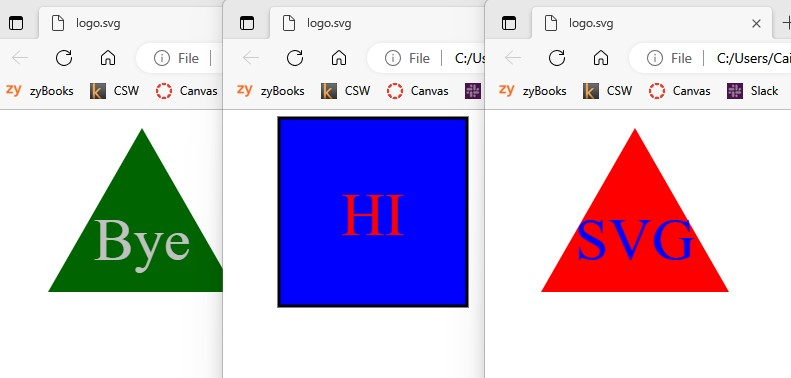

# 10-Shapey-Shapes
## Description
This is a command-line application that will generate an HTML file with an SVG logo.

### By: Caine Winters

## Usage
- Navigate to directory holding the "index.js" file.
- User enters "npm start" or "node index.js" to exectute the application.
- Answer the prompts presented.
    Validations:
        - Color selections must be either one of the 138 named colors found in the colors.txt file in the lib directory or a hexedecimal color (correctly formatted: leading with '#' and 3 or 6 characters A-F and/or 0-9).
        - Text entries for the logo must be less than 3 characters long.
- Once complete, the logo.svg file is output to the Images directory.
- Use "npm test" to run a battery of Jest tests.
- There are text and color setters built into the classes but there is no real use for them at this point other than part of the Jest tests.  These elements are currently set during instantiation.  The setters were included simply because there were some examples of tests provided in the instructions that showed them.

### Screenshots of logos 

## Links
### [Link to repo](https://github.com/elcaine/10-Shapey-Shapes)
### [Link to video](https://www.youtube.com/watch?v=EBqvwCcB5wg)

### Acknowledged sources
- [Coderslang: ](https://learn.coderslang.com/0028-html-colors-with-names-hex-and-rgb-codes/) Original source of html/hex colors.